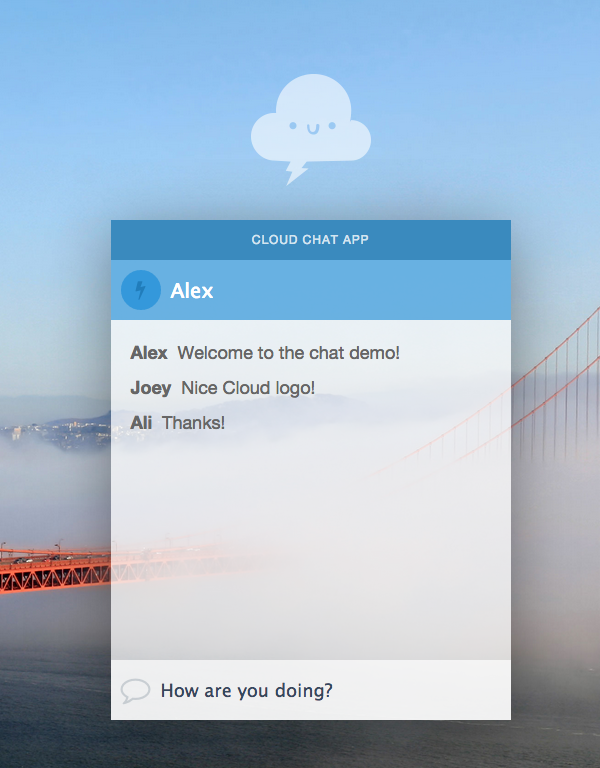

# Cloud Chat Demo

Cloud chat is a realtime chat demo powered by [Firebase](https://www.firebase.com/). This example demonstrates how easy it is to create a realtime multi-person chat client with JavaScript, HTML, and
CSS. View the [live demo](http://firebase.github.io/cloud-chat/) to see it in action.

## Development

To use the demo follow the steps below:

1. Download or clone this repo.
2. Open `js/chat-with-firebase.js` and replace the Firebase database URL with one from your own
account. You can [sign up for free](https://www.firebase.com/).
3. Open `index.html` in your browser and have fun!

This repo contains two JavaScript files:

1. [`js/chat-no-firebase.js`](./js/chat-no-firebase.js) - Non-Firebase-backed chat with does not
persist messages upon page refresh.
2. [`js/chat-with-firebase.js`](./js/chat-with-firebase.js)- Firebase-backed chat which persists
messages to Firebase.

## Photography License

The background photo used was taken by Brocken Inaglory and is available under the Creative Commons
license. For more information on this photo and acceptable use please visit [Wikimedia Commons](http://commons.wikimedia.org/wiki/File:Golden_Gate_Bridge,_San_Francisco_and_Sutro_Tower.jpg).

## Repository License
MIT - [http://firebase.mit-license.org](http://firebase.mit-license.org)
